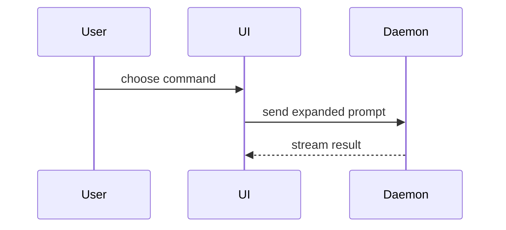

Use the PR template of the repository. Look for it in `.github/pull_request_template.md`, `.github/PULL_REQUEST_TEMPLATE.md`, `.github/PULL_REQUEST_TEMPLATE/`, `docs/`, or the repository root. Fill in every section that the template asks for, and tick only the checklist items that are true.

The default body is one sentence that says what the PR does and why: "adds X to get Y", "fixes Z when W". Add the parts below only when the diff alone would confuse a reviewer. Put each part in the template section that fits it.

If the repository has no template, use this one:

```markdown
<one sentence: what the PR does and why>

<optional: diagram, diff-sketch, or tree>

**Merge danger:** <one-way or two-way door>, <blast radius in one word>
```

## Sections

Skip all preambles and keep prose brief. Use the user's domain language from `GLOSSARY.md`.

### Summary

Pick the smallest view that makes the key point clear.

- Show logic or an algorithm as pseudocode:

```text
on(save)
  if content is unchanged
    return cached result
  write new content
  return fresh result
```

- Show runtime control flow as a call tree:

```text
submitForm
  createSession
    persistPrompt
    launchAgent
  navigateToSession
```

- Show UI structure as a component tree, including state and module boundaries that matter:

```text
<SessionPage> (apps/example/src/routes/session.tsx)
  useSessionEvents()
  <SessionToolbar>
    <RunSkillButton> (packages/ui)
```

- Show file responsibility or a broad refactor as a shallow file tree:

```text
src/
├── commands/       # parses user actions
├── sessions/       # owns session state
└── transport/      # sends API requests
```

- Show component interaction, control flow, or data flow with Mermaid:



- Use `diff` when the point is what changes and the surrounding shape already exists. Match the diff shape to the topic.

For a component change:

```diff
 <SessionPage>
   useSessionEvents()
   <SessionToolbar>
+    <RunSkillButton />
   <SessionTimeline>
+    <SkillResultCard />
```

For a file-layout change:

```diff
 src/
 ├── commands/
+│   └── show-me.ts       # expands the slash command
 ├── sessions/
-└── transport.ts
+└── transport/
+    ├── client.ts
+    └── stream.ts
```

For a call-tree or call-stack change:

```diff
 submitForm
   createSession
     persistPrompt
+    expandSkillMention
     launchAgent
-  navigateToSession
+  navigateToSession
+    subscribeToEvents
```

For a state or control-flow change:

```diff
 on(save)
-  write content
+  if content is unchanged
+    return cached result
+  write new content
+  invalidate cache
```

- Show the whole block when most of it is new, when omitted context would hide ownership or order, or when the user needs a copyable target shape:

```ts
function expandSkill(command: string): string {
  const skillName = command.slice(1);
  return `use the ${skillName} skill`;
}
```

#### Guidance

Place each visual next to the short text it supports. Keep only the calls, files, props, states, and boundaries needed to answer the user's current question or the options to resolve the current discussion point.

You may use one of these, you may use several, it is unlikely you will use all of them. Use your judgement and don't overwhelm the user.

### Evidence

Give evidence only for what CI cannot see: a manual run of the built binary, real output, a screenshot of a visual change, or the specific edge case that the change targets. Do not list lint, unit tests, builds, or other commands that CI runs. If CI covers everything, write one short sentence that says so.

Screenshots are the best evidence when the change is visual and the environment can make them. Show a before and an after.

### Merge danger

Use one line. Add a sentence only when the risk is not clear from the line.

Describe whether it's a one-way or two-way door. You can walk back through two-way doors, but not one-way doors. A PR that is cheap to roll back is lower risk. Changes that involve destructive actions or hard-to-reverse decisions are one-way doors.

The blast radius is the potential impact or scope of the changes introduced by this PR. Consider all possibilities. Examples are layout shift, breakages for consumers, mobile responsiveness, etc.

## Prose

Before you show or post the body, write all of its prose with the `simple-english` skill, then apply the `unslop` skill to it. Apply both to prose only: the template headings, checklists, code blocks, and diagrams stay as they are.

If the Skill tool cannot start a skill, find its `SKILL.md` in the installed skills folder, read it, and apply it. `unslop` runs only when the user types it, so this is the usual path for it.

If a skill is not installed, ask the user if they want to install it:

- `simple-english`: `npx skills add aminblg/simpleenglish --skill simple-english` ([skills.sh](https://www.skills.sh/aminblg/simpleenglish/simple-english))
- `unslop`: `npx skills add cursor/plugins --skill unslop` ([skills.sh](https://www.skills.sh/cursor/plugins/unslop))

If the user says no, write the body without that skill and tell the user which pass you skipped.
